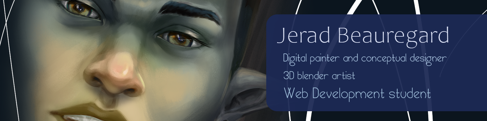
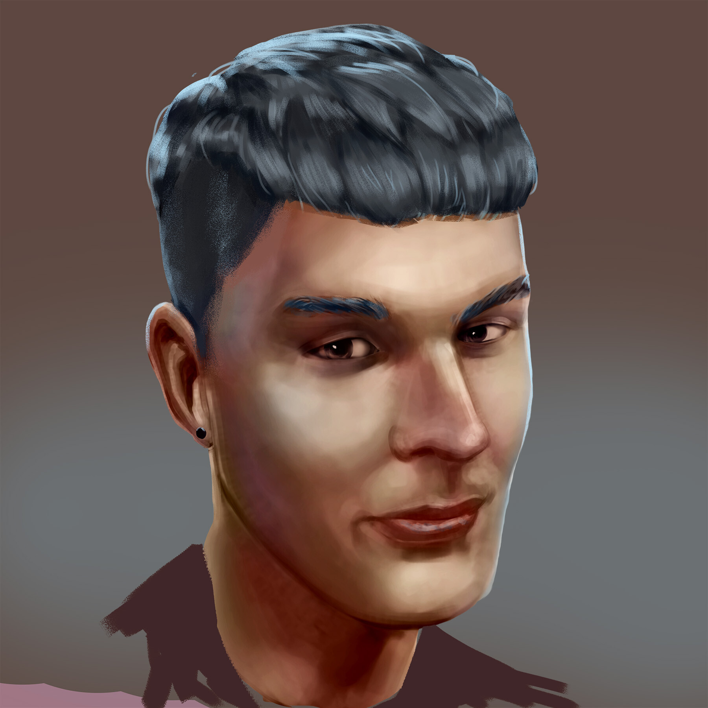

# Jerad Beauregard's Markdown Portfolio Home

## Links

[Contact Me](./contact.md)
[My Projects](./projects.md)

## About me

BFA Drawing and Painting OCAD University, Post-Graduate Certificate Concept Art for Entertainment Design George Brown College, Currently enrolled in Web Development at Humber Polytechnic. I enjoy art and coding.

## My Self Portraits

careful the goblin is before I have my coffee!

| Goblin Jerad | Normal Jerad |
---------------------------------------|---------------------------------
 |  |  |